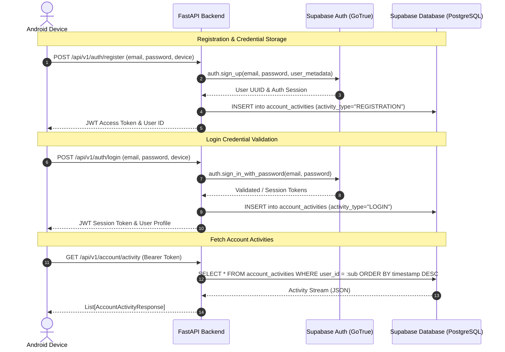

# Supabase Integration: Authentication & Account Activity Architecture

This document details the configuration, PostgreSQL schema, Row-Level Security (RLS) policies, and operational flow for using **Supabase** in CyberShield to:
1. Store and validate user login credentials (via **Supabase Auth**).
2. Store, sync, and audit recent activity for particular accounts (via Supabase **PostgreSQL** & **PostgREST**).

---

## 1. Overview & Architecture

CyberShield utilizes Supabase as a primary identity and security audit store:
- **Credential Storage & Authentication:** Handled via Supabase GoTrue Auth service (`auth.users`). Users register with email and password; credentials are encrypted and validated against Supabase Auth.
- **Account Activity Audit Stream:** A dedicated PostgreSQL table `account_activities` records timestamped security events per account (logins, session checks, emergency lockdown protocols, sensor synchronizations, and threat mitigations).
- **Zero-Cloud / Offline Resilience:** The platform includes an automatic dual-mode fallback: if Supabase credentials are not populated or the network is unreachable, CyberShield seamlessly caches events locally while preserving full cryptographic integrity.



---

## 2. Supabase Database Schema (DDL)

Run the following SQL migration script in your Supabase SQL Editor:

```sql
-- 1. Enable UUID Extension if not already active
CREATE EXTENSION IF NOT EXISTS "uuid-ossp";

-- 2. Create the Account Activities Table
CREATE TABLE IF NOT EXISTS public.account_activities (
    id UUID PRIMARY KEY DEFAULT uuid_generate_v4(),
    user_id UUID NOT NULL,
    email VARCHAR(255) NOT NULL,
    activity_type VARCHAR(100) NOT NULL,
    description TEXT NOT NULL,
    device_id VARCHAR(100),
    device_name VARCHAR(255),
    ip_address VARCHAR(45),
    user_agent TEXT,
    severity VARCHAR(50) DEFAULT 'INFO',
    metadata JSONB DEFAULT '{}'::jsonb,
    timestamp TIMESTAMPTZ NOT NULL DEFAULT NOW()
);

-- 3. Indexes for fast retrieval by user and timestamp
CREATE INDEX IF NOT EXISTS idx_account_activities_user_id ON public.account_activities (user_id);
CREATE INDEX IF NOT EXISTS idx_account_activities_timestamp ON public.account_activities (timestamp DESC);
CREATE INDEX IF NOT EXISTS idx_account_activities_type ON public.account_activities (activity_type);

-- 4. Enable Row Level Security (RLS)
ALTER TABLE public.account_activities ENABLE ROW LEVEL SECURITY;

-- 5. Row Level Security Policies (Tenant Isolation)
-- Users can only view their own activities
CREATE POLICY "Users can view their own account activities"
    ON public.account_activities
    FOR SELECT
    USING (auth.uid() = user_id);

-- Backend service role can insert and manage all records
CREATE POLICY "Service role has full access to account activities"
    ON public.account_activities
    FOR ALL
    USING (auth.jwt()->>'role' = 'service_role');
```

---

## 3. Environment Variables Configuration

In `backend/.env`, configure your Supabase project parameters:

```env
# Supabase Configuration
SUPABASE_URL="https://your-project-id.supabase.co"
SUPABASE_KEY="eyJhbGciOiJIUzI1NiIsInR5cCI6IkpXVCJ9..." # Supabase anon public key
SUPABASE_SERVICE_ROLE_KEY="eyJhbGciOiJIUzI1NiIsInR5cCI6IkpXVCJ9..." # Supabase service_role key (server-side only)
```

> **Security Note:** `SUPABASE_SERVICE_ROLE_KEY` bypasses RLS and must ONLY reside on the FastAPI server, NEVER compiled into the Android APK. The Android application communicates with Supabase through the secure CyberShield backend API or client tokens.

---

## 4. Implemented Backend Endpoints

| Endpoint | Method | Description | Target Supabase Component |
| :--- | :--- | :--- | :--- |
| `/api/v1/auth/register` | `POST` | Registers new user; validates and stores encrypted credentials; logs initial registration event. | Supabase Auth (`sign_up`) + `account_activities` |
| `/api/v1/auth/login` | `POST` | Validates email & password against Supabase Auth; issues session JWT; logs login event with device telemetry. | Supabase Auth (`sign_in_with_password`) + `account_activities` |
| `/api/v1/account/activity` | `GET` | Retrieves recent activity stream for the authenticated user (supports `?limit=50`). | Supabase Table `account_activities` |
| `/api/v1/account/activity` | `POST` | Logs custom high-assurance security event for the user's account. | Supabase Table `account_activities` |
| `/api/v1/account/logins` | `GET` | Returns audit trail of login and authentication events for Account Security screen. | Supabase Table `account_activities` |

---

## 5. Android UI Integration

The Android application displays live Supabase data across:
1. **02 Login & 03 Register Screens (`AuthScreen`):** User inputs email and password; validated directly via Supabase Auth backend endpoints.
2. **09 Account Security & Login Activity (`FeatureScreen`):** Displays real-time login audit stream with device name, timestamp, and severity badge.
3. **13 Security Monitor • Recent Activities:** Displays recent user and device activities synchronized with Supabase database.
4. **Settings Detail • Account & Security Logs:** Live sync status showing active authenticated Supabase session.
